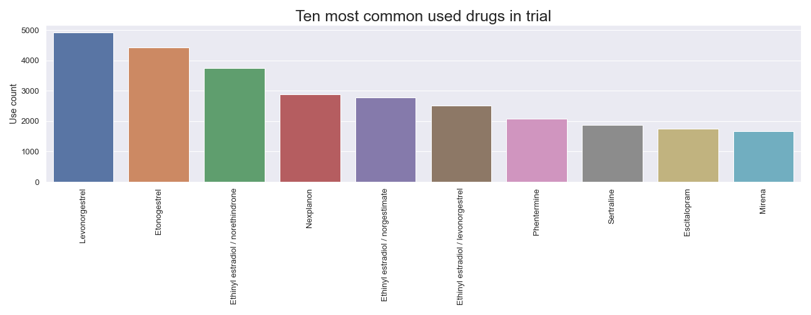
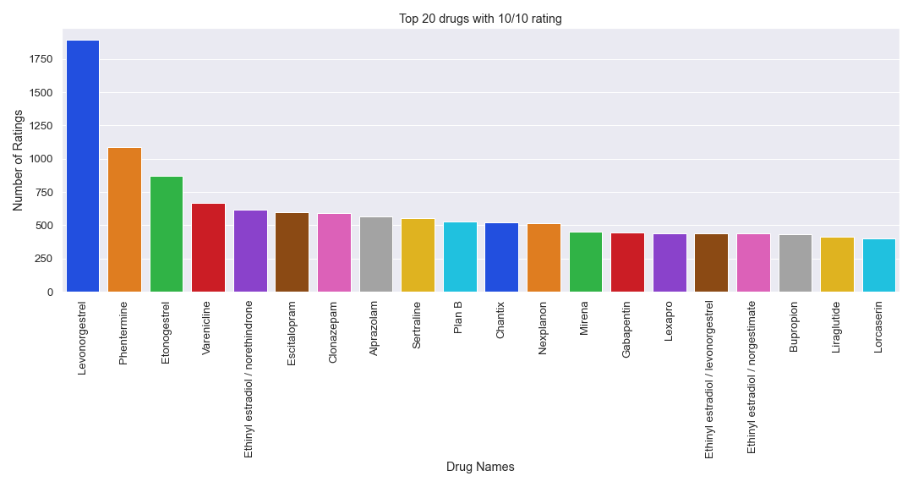
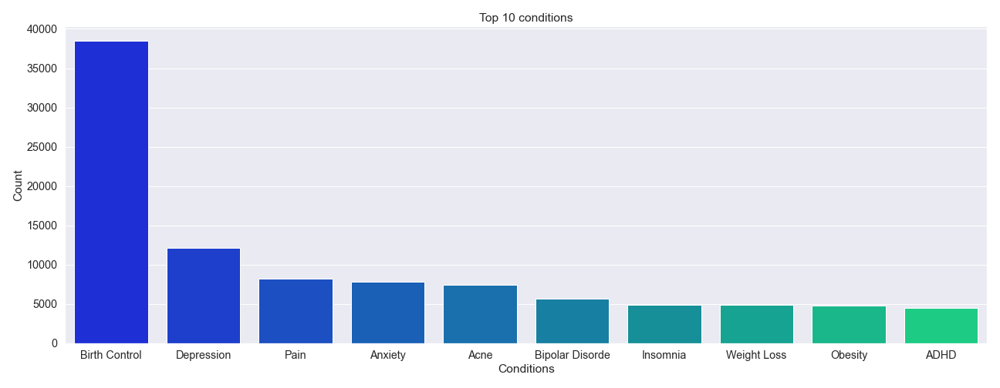
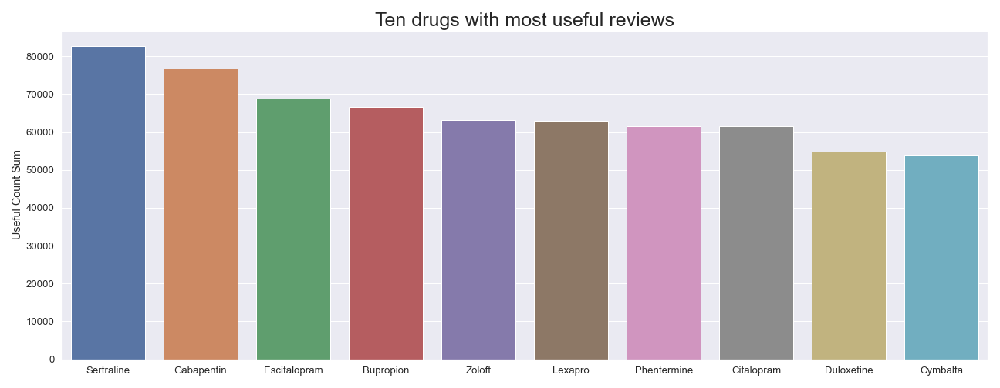

# drug_sentiment_analysis
Drug review analysis just made this as a reference project for sentiment analysis for future work

## Based on UCI ML Drug dataset
Data overview
    * 215063 entries 
    * 3671 Drugs
    * 916 unique conditions
    * 128478 comments/reviews of drug effect and experience
    * ratings of drug experience 1-10 (1 lowest, 10 highest)
    * dates of entry (February 24 2008-December 12, 2017)
    * The count of people who found entry useful (usefulCount)

### Sentiment >=7 = Positive
### Sentiment >3 and <7 Neutral
### Sentiment <=3 Negative

# Text data section
All Reviews

Postive Reviews 

Negative Reviews

# Time data

# Drugs with most useful reviews & comments

# NLP & Sentiment Analysis

### reference work by HARSH JAIN
